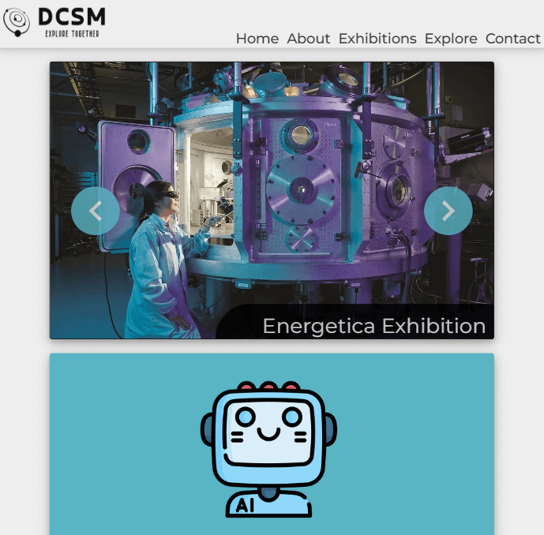

# Drammen Community Science Museum - DCSM

This is the first semester project at Noroff for Front End Developer studies.
This project is a site for a Community Science Museum based in Drammen, Norway.
The Community Science Museum target audience is children from 7-15 years of age including families with small children.

## Table of Contents

- [About the Project](#about-the-project)
- [Features](#features)
- [Technologies Used](#technologies-used)
- [Live Site](#live-site)
- [Future Enhancements](#future-enhancements)

## About the Project

Semester Project 1 assignment was described as a contract from a client where the client wanted a site where they could showcase their local museum.
The client wanted a modern responsive website where they could keep their visitors/people interested in learning about the museum informed.

As for the assignment itself this was a pure HTML/CSS assignment with focus on using semantic HTML and developing the site using the DRY principles.
I was not allowed to use anything but HTML and CSS for this project, so there is no frameworks used for this project.

## Features

### Explore:

- Explore the museum, there is something for everyone. Children, Teachers and Researchers.

### Contact us:

- People, schools and others can contact us regarding upcoming events and exhibitions.

### About

- Learn more about Drammen Community Sciense Museum on our website.

### What we offer

We display everything we have to offer on our website, the website is also kept up to date with future events.
Some of what we offer at our location is:

- Food and drink - Visitors can visit our café to buy food/drink.
- Memoroabilia - Our shop offers items from the museum as well as great gifts.
- Accessibility - The museum has wheelchair accessibility, it also has audio guides and braille display signs for the visually impaired.
- Opening hours - We showcase our opening hours on our website.
- Admission fee - Entrance is free for all, there is however a small fee for guided tours.

## Technologies Used

This site was built using:

- HTML5
- CSS

## Live Site

Link to our website:

[Drammen Community Science Museum](https://arkuradev.github.io/Semester-Project-1/index.html)
